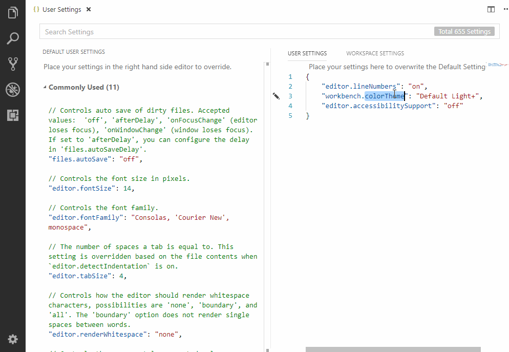
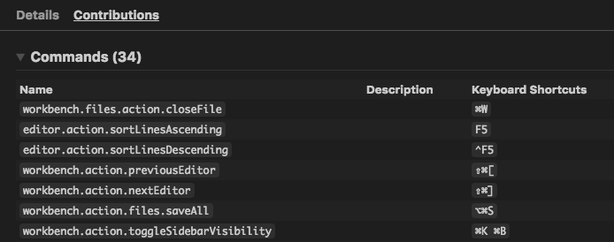

# Sublime Importer for VS Code

This extension imports keybindings and settings from Sublime Text to VS Code.

## Getting Started
### Keymappings
This extension ports the most popular Sublime Text keyboard shortcuts to Visual Studio Code.  
Just restart VS Code after the installation of this extension and your favorite Sublime Text keyboard shortcuts will be available in VS Code. 
### Importing settings
The first time the extension is launched a prompt is shown that lets you import your Sublime Settings.  
If you want to import your settings at a later time use the `Sublime Text Keymap: Import Sublime Text Settings` command from the Command Palette (F1).


## FAQ
### What keyboard shortcuts are included?

The included keyboard shortcuts can be looked up in the [contribution list](https://code.visualstudio.com/docs/editor/extension-gallery#_extension-details). 



### Why don't all Sublime Text commands work? 

VS Code has not implemented all features. Head on over to this [GitHub issue](https://github.com/Microsoft/vscode/issues/3776) and let the VS Code team know what you'd like to see. 

You can install an extension for many of these features:

* [Expand Selection To Scope](https://marketplace.visualstudio.com/items?itemName=vittorioromeo.expand-selection-to-scope)
* [FontSize Shortcuts](https://marketplace.visualstudio.com/items?itemName=peterjuras.fontsize-shortcuts)
* [change case](https://marketplace.visualstudio.com/items?itemName=wmaurer.change-case)
* [expand-region](https://marketplace.visualstudio.com/items?itemName=letrieu.expand-region)
* [transpose](https://marketplace.visualstudio.com/items?itemName=v4run.transpose)
* [Close HTML/XML tag](https://marketplace.visualstudio.com/items?itemName=Compulim.compulim-vscode-closetag)

## Contributing
### How do I contribute a keyboard shortcut?

We may have missed a keyboard shortcut. If we did please help us out! It is very easy to make a PR. 

1. Head over to our [GitHub repository](https://github.com/Microsoft/vscode-sublime-keybindings). 
2. Open the [`package.json` file](https://github.com/Microsoft/vscode-sublime-keybindings/blob/main/package.json). 
3. Add a JSON object to [`contributes.keybindings`](https://github.com/Microsoft/vscode-sublime-keybindings/blob/main/package.json#L57) as seen below. 
4. Open a pull request. 

```json
{
    "mac": "<keyboard shortcut for mac>",
    "linux": "<keyboard shortcut for linux>",
    "win": "<keyboard shortcut for windows>",
    "key": "<default keyboard shortcut>",
    "command": "<name of the command in VS Code>"
}
```

### How do I contribute a Sublime setting?

There are two different types of settings files: The ```mappings``` file holds the information on how a sublime setting can be mapped to a VS Code setting. The ```defaults``` file contains default Sublime settings that are not explicitly set in the Sublime settings file (e.g. the Monokai theme).  
To make a Pull Request:
1. Head over to our [GitHub repository](https://github.com/Microsoft/vscode-sublime-keybindings). 
2. Open the [`settings/mappings.json`](https://github.com/Microsoft/vscode-sublime-keybindings/blob/main/settings/mappings.json) or the [`settings/defaults.json`](https://github.com/Microsoft/vscode-sublime-keybindings/blob/main/settings/defaults.json) file.  
3. Add your setting 
4. Open a pull request. 


## License
[MIT](LICENSE.md)
